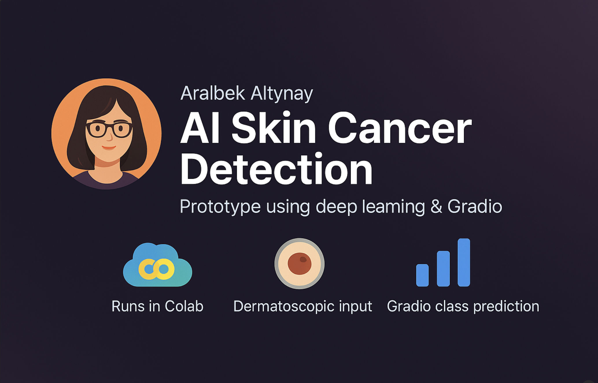

  

# CancerMe – AI Skin Cancer Detection  
**Author**: Aralbek Altynay  
**Prototype project using deep learning and Gradio (Colab-based)**  

## 🧬 Overview  
**CancerMe** is a prototype for skin cancer detection using deep learning and a simplified AI interface built with **Gradio**.  
It allows users to upload dermatoscopic images (e.g. mole photos) and receive a class prediction based on the **HAM10000** dataset.

This is not yet a standalone web app — it currently runs in **Google Colab** as a proof of concept and can be used directly from within a notebook.

## ✅ What Makes It Unique?

- 🔬 **Built from scratch** using raw dataset and image preprocessing  
- 🧠 Trained a **custom Convolutional Neural Network (CNN)**  
- 📊 Evaluated model with test metrics and class balance analysis  
- 🖼️ Includes **random image prediction testing block** (visual + prediction)  
- 🌐 **Interactive interface using Gradio**, allowing non-programmers to use the model  
- 💡 Clean interface, author name included, easy to expand into a full web app

## 🧠 Features

- 🌐 Built on top of the HAM10000 skin lesion dataset (Kaggle)
- 🧪 Trained a CNN model to classify 7 types of skin lesions
- 📸 Accepts dermatoscopic image input
- 🔍 Predicts the lesion class using AI
- 🧑‍💻 Built with Google Colab + TensorFlow + Gradio
- ⚡ Fast prototype, runs entirely in a notebook

## 🗂 Dataset Used  
- **HAM10000 (Human Against Machine)**  
- Source: [Kaggle – skin-cancer-mnist-ham10000](https://www.kaggle.com/datasets/kmader/skin-cancer-mnist-ham10000)  
- License: **CC BY-NC-SA 4.0**
- 
## 🔎 Target Classes

Model classifies images into the following skin lesion types:

- `akiec`: Actinic keratoses  
- `bcc`: Basal cell carcinoma  
- `bkl`: Benign keratosis  
- `df`: Dermatofibroma  
- `mel`: Melanoma  
- `nv`: Melanocytic nevi  
- `vasc`: Vascular lesions

## ⚙️ How to Run

You can run this notebook directly in [Google Colab](https://colab.research.google.com/):

1. Clone the repo or open the notebook in Colab
2. Upload your own `kaggle.json` API key to download the dataset
3. Run all cells
4. Use the Gradio UI to upload images and get predictions

## 📌 Author Contribution

This notebook was:

- Modified and extended from the original Kaggle dataset  
- Model trained and tuned from scratch  
- Gradio interface added manually  
- Organized, visualized and deployed in Colab by **Aralbek Altynay**

## 🌐 License & Acknowledgements
- Dataset: [HAM10000 - Human Against Machine](https://www.kaggle.com/datasets/kmader/skin-cancer-mnist-ham10000)
- Inspired by open-source community projects
- Developed as a PhD student’s prototype: Aralbek Altynay  
- Notebook created for educational and experimental purposes  
- Please cite the dataset if re-used in future work
- This project is licensed under the MIT License. See the LICENSE file for details.

## 🚧 Future Work  
- Turn this prototype into a web app with deployment (e.g. Hugging Face Spaces, Streamlit Cloud)  
- Improve model accuracy and add confidence scores  
- Include bounding box detection and image augmentation pipeline  
